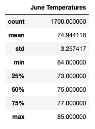
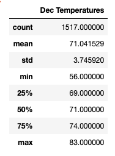

# surfs_up

##Project Overview

Gather temperature data for June & December in Oahu for W. Avy so he can determine if opening a surf and ice cream shop is a sustainable business year round.

##Results

* Oahu's mean temperature is 74.94 degrees farenheight in June. Oahu's mean temperature is 71.04 degrees farenheight in December.
* Oahu's minimum temperature is 64 degrees farenheight in June. Oahu's minimum temperature is 56 degrees farenheight in December. 
* Oahu's maximum temperature is 85 degrees farenheight in June. Oahu's maximum temperature is 83 degrees farenheight in December.

  

##Summary

* additional item
* additional item
