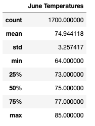
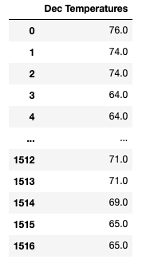
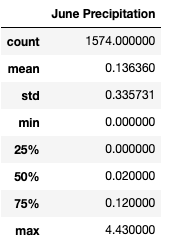
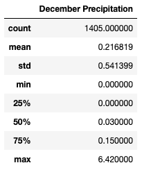

# surfs_up

##Project Overview

Gather temperature data for June & December in Oahu for W. Avy so he can determine if opening a surf and ice cream shop is a sustainable business year round.

##Results

* Oahu's mean temperature is 74.94 degrees farenheight in June. Oahu's mean temperature is 71.04 degrees farenheight in December.
* Oahu's minimum temperature is 64 degrees farenheight in June. Oahu's minimum temperature is 56 degrees farenheight in December. 
* Oahu's maximum temperature is 85 degrees farenheight in June. Oahu's maximum temperature is 83 degrees farenheight in December.

  

##Summary

Oahu seems to have a steady temperature year round only fluctuating roughly 29 degrees between the coldest part of December and the hottest part of June. One might assume that the low temperature in December is a cold front moving through or perhaps a temperature recorded early in the morning and not during the middle of the day. W. Avy will not have any issues opening a surf and ice cream shop.

###Additional Metrics
* Oahu's mean precipitation score is 0.13 for the month of June. Oahu's mean precipitation score is 0.21 for the month of December. 
* Precipitation is an important metric to look at because if it is raining too often, the likelihood of being open is lower, which lowers business profits. Luckily, it appears that both June and December have lower precipitation scores, therefore, W. Avy won't have to worry about rain/precipitation affecting his business being open.

  
